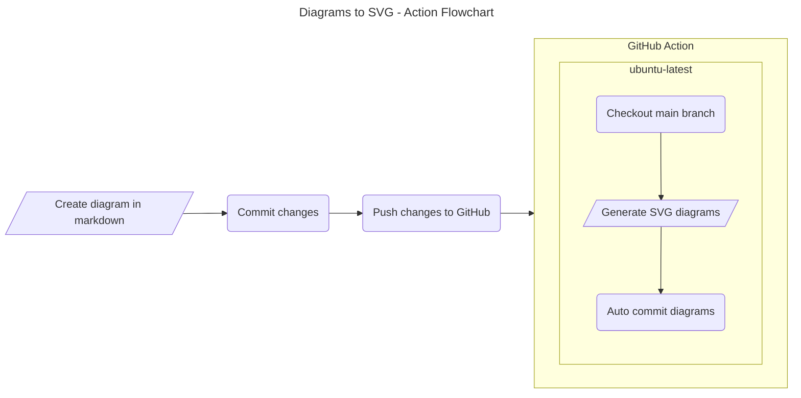

# Diagrams

This project has been configured to generate and commit SVG versions of [Mermaid](https://mermaid.js.org/intro/) diagrams.

# Steps to generate an SVG diagram
1. Add Mermaid syntax to a markdown file.
2. Commit and push changes to GitHub.
3. The GitHub action will automatically execute and if all well a SVG version of the diagram will be generated and added to the same directory.

# Tips
- Visit [Mermaid](https://mermaid.js.org/syntax/flowchart.html) for loads more information on diagram syntax.
- For a live preview of diagrams as you edit, use [Visual Studio Code](https://code.visualstudio.com/) and add the [Markdown Preview Mermaid](https://marketplace.visualstudio.com/items?itemName=bierner.markdown-mermaid) plugin.