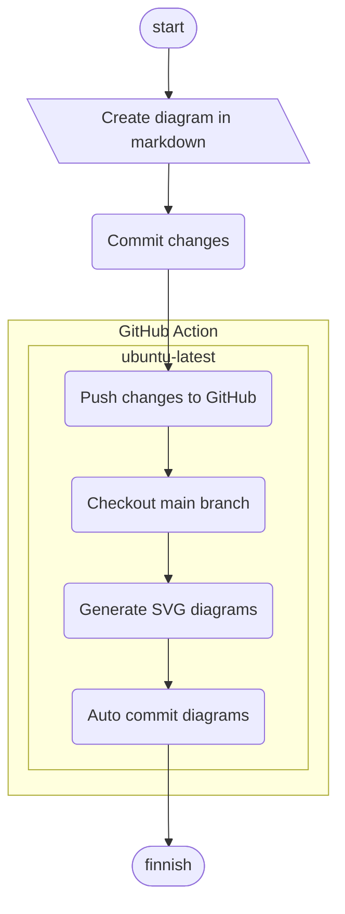

# GitHub Action: Convert Mermaid Diagrams In Markdown To SVG


```mermaid
flowchart LR
  subgraph TOP
    direction TB
    subgraph B1
        direction RL
        i1 -->f1
    end
    subgraph B2
        direction BT
        i2 -->f2
    end
  end
  A --> TOP --> B
  B1 --> B2
  ```
  ```mermaid
flowchart TB
    commit --> push
    push --> action
    subgraph action
      direction TB
      subgraph ubuntu-latest
        direction LR
        checkout --> generate
        generate --> auto-commit
      end
    end
    action --> finnish
```