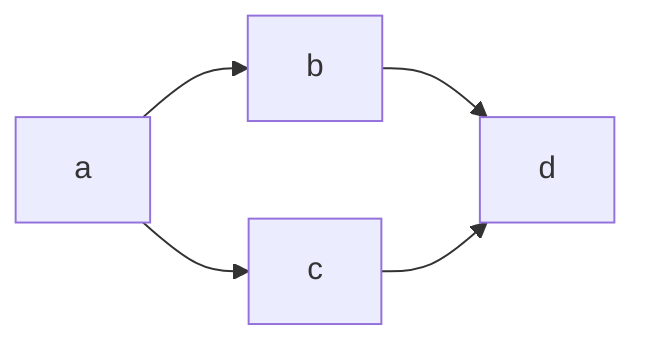
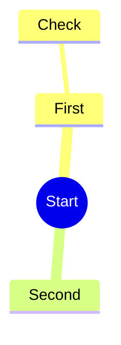

``` mermaid
flowchart LR;
  a --> b & c --> d;  
```

```mermaid
graph LR
    fa:fa-check-->fa:fa-coffee
```

```mermaid
mindmap
  root((Start))
    First
      Check
    Second
```

::: mermaid
graph TD;
    A-->B;
    A-->C;
    B-->D;
    C-->D;
:::